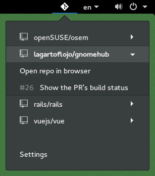

# GnomeHub

 A Gnome Shell extension that shows your favorite GitHub repositories and their open pull requests on the top panel.

 

## Installation

You can install GnomeHub directly from its page on [extensions.gnome.org](https://extensions.gnome.org/extension/1263/gnomehub/).

## Testing

Tests are written in [Jasmine](https://jasmine.github.io). To run them, you need
[jasmine-gjs](https://github.com/ptomato/jasmine-gjs), a special runner of Jasmine designed for GJS.
You can install it by [compiling it](https://github.com/ptomato/jasmine-gjs/#installation) or
by downloading a [pre-compiled package](https://software.opensuse.org/package/jasmine-gjs) for your OS.

Once installed, you can run the tests:

```bash
$ cd gnomehub
$ jasmine
```

## Debugging

Print messages with `log()` or `print()` and see them in:

```
journalctl -f /usr/bin/gnome-session
```

## Translations

When introducing new strings that need to be translated, update the translation
template file `locale/gnomehub.pot` by running:

```
make potfile
```

To update an existing language's PO with new strings, run (replacing `$LANG` with
the language code):

```
msgmerge --backup=off -U locale/$LANG/LC_MESSAGES/gnomehub.po locale/gnomehub.pot
```

To add a new language, run the following commands (replacing `$LANG` with the
language code):

```
mkdir -p locale/$LANG/LC_MESSAGES/
msginit --locale=$LANG --input=locale/gnomehub.pot -o locale/$LANG/LC_MESSAGES/gnomehub.po
```

## Credits

Created by Hernán Schmidt during the SUSE Hack Week 2015.

&copy; 2017 Hernán Schmidt. This software is licensed under the GPLv3 License.
